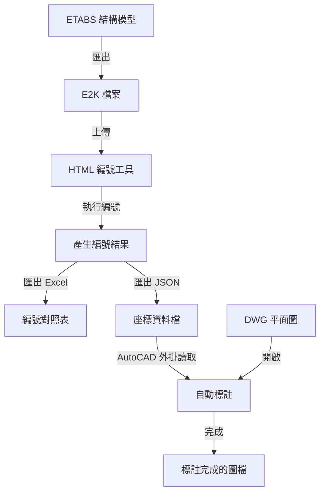

# ETABS 梁編號 → AutoCAD 自動標註系統

## 🎯 系統目標

將 ETABS 的梁編號結果自動標註到 AutoCAD 的結構平面圖上，完全自動化，無需手動逐一標註。

---

## 📦 系統組成

### 1. HTML 編號工具 ([index.html](index.html))
- **功能**: 讀取 ETABS E2K 檔案，自動產生梁編號
- **輸入**: `.e2k` 檔案 (ETABS 匯出)
- **輸出**:
  - Excel 對照表 (ETABS 編號 → 新編號)
  - **JSON 座標檔** (給 AutoCAD 外掛使用)

### 2. AutoCAD C# 外掛 ([AutoCAD_Labeling/](AutoCAD_Labeling/))
- **功能**: 讀取 JSON 檔案，在 AutoCAD 中自動標註
- **輸入**: JSON 座標檔 + DWG 平面圖
- **輸出**: 標註完成的 DWG 檔案

---

## 🔄 完整工作流程



---

## 📊 資料格式設計

### JSON 中間檔案格式

```json
{
  "project": "ETABS梁編號專案",
  "exportDate": "2025-10-05T12:00:00Z",
  "floors": [
    {
      "floorName": "2F",
      "beams": [
        {
          "etabsId": "B65",
          "newLabel": "GAa-2",
          "startPoint": {
            "id": "270",
            "x": 11.7,
            "y": 2.6
          },
          "endPoint": {
            "id": "271",
            "x": 16.8,
            "y": 2.6
          },
          "midPoint": {
            "x": 14.25,
            "y": 2.6
          },
          "length": 5.1,
          "section": "B50X70C280",
          "isMainBeam": true
        }
      ]
    }
  ]
}
```

### 為什麼用座標而不用軸線編號?

**考慮過的方案:**
1. ❌ 軸線編號 (例如: "起點 2-A, 終點 3-A")
   - 問題: ETABS 和 AutoCAD 的軸線命名可能不同
   - 問題: 需要手動建立軸線對應關係

2. ✅ **絕對座標 (採用此方案)**
   - 優點: ETABS 和 AutoCAD 都有明確的座標系統
   - 優點: 只需設定一個基準點即可轉換
   - 缺點: 需要手動設定縮放比例 (但這是一次性設定)

---

## 🛠️ 技術細節

### 座標轉換原理

**ETABS 座標** (單位: 公尺)
```
梁中點座標: (14.25, 2.6)
```

**AutoCAD 座標** (單位: 毫米)
```
使用者點選基準點: (5000, 3000)
縮放比例: 1000 (1m = 1000mm)

標註位置 = 基準點 + ETABS座標 × 縮放比例
        = (5000, 3000) + (14.25, 2.6) × 1000
        = (5000 + 14250, 3000 + 2600)
        = (19250, 5600)
```

### 自動偵測軸線 (進階功能)

外掛可以自動搜尋 AutoCAD 圖中的軸線文字:
- 偵測圓圈中的數字/字母 (例如: 0, 1, 2, A, B, C)
- 根據位置分類為 X 軸線或 Y 軸線
- 找到指定軸線的交點作為基準點

**限制**: 軸線必須是標準的 DBText 或 MText 物件。

---

## 📝 使用範例

### 範例 1: 標註 2F 樓層

1. **在 HTML 工具中:**
   - 上傳 `Twin 2F.e2k`
   - 執行編號
   - 匯出 `beam_data.json`

2. **在 AutoCAD 中:**
   ```
   命令: NETLOAD
   → 選擇 BeamLabeler.dll

   命令: LABELBEAMS
   → 選擇 beam_data.json
   → 輸入 1 (選擇 2F)
   → Manual 模式
   → 點選軸線 0-A 交點
   → 縮放比例 1000
   → 文字高度 250
   → 完成！共標註 50 根梁
   ```

### 範例 2: 標註多個樓層

需要重複執行 `LABELBEAMS` 命令:
- 第一次選擇 2F
- 第二次選擇 3F
- ...以此類推

**注意**: 每個樓層的基準點可能不同！

---

## 🎨 標註結果

### 圖層分類
- `梁編號-大梁`: 主梁 (G 開頭的編號)
- `梁編號-小梁`: 次梁 (B、FB 開頭的編號)

### 文字位置
- 位於梁的中點
- 水平、垂直置中對齊

### 可調整項目
- 文字高度
- 圖層顏色
- 文字樣式 (需修改程式碼)

---

## ⚡ 優勢分析

| 項目 | 傳統手動方式 | 本系統 |
|------|-------------|--------|
| 標註 100 根梁 | 約 2-3 小時 | 約 5 分鐘 |
| 錯誤率 | 高 (容易標錯位置) | 低 (自動計算) |
| 重複作業 | 每次變更都要重做 | 重新執行即可 |
| 學習曲線 | 低 | 中等 (需設定一次) |

---

## 🔮 未來擴充方向

### 短期 (可立即實作)
- [ ] 批次標註多個樓層
- [ ] 支援柱編號標註
- [ ] 自訂文字樣式、顏色
- [ ] 標註時檢查重複標註

### 中期 (需要更多開發)
- [ ] 自動偵測圖框範圍
- [ ] 智慧避讓 (文字不要重疊)
- [ ] 生成標註統計報表
- [ ] 支援配置空間標註

### 長期 (需要深入研究)
- [ ] 自動辨識梁位置 (電腦視覺)
- [ ] 與 Revit 整合
- [ ] Web 版本 (不需安裝 AutoCAD)

---

## 🐛 已知限制

1. **單位轉換需手動設定**
   - 需要使用者輸入縮放比例
   - 無法自動偵測 AutoCAD 單位

2. **基準點需手動設定**
   - 雖有自動偵測功能，但不一定準確
   - 建議手動點選確保正確

3. **僅支援模型空間**
   - 無法直接標註到配置空間

4. **圖層自動建立**
   - 如果圖層已存在且鎖定，會標註失敗

---

## 📚 相關檔案

- [快速入門.md](AutoCAD_Labeling/快速入門.md) - 使用教學
- [README.md](AutoCAD_Labeling/README.md) - 技術文件
- [index.html](index.html) - HTML 編號工具
- [Commands.cs](AutoCAD_Labeling/Commands.cs) - AutoCAD 外掛原始碼

---

## 🙏 致謝

本系統整合了:
- ETABS E2K 格式解析
- AutoCAD .NET API
- System.Text.Json 序列化
- P5.js 視覺化

---

**版本**: 1.0
**最後更新**: 2025-10-05
**作者**: Claude Code Assistant
